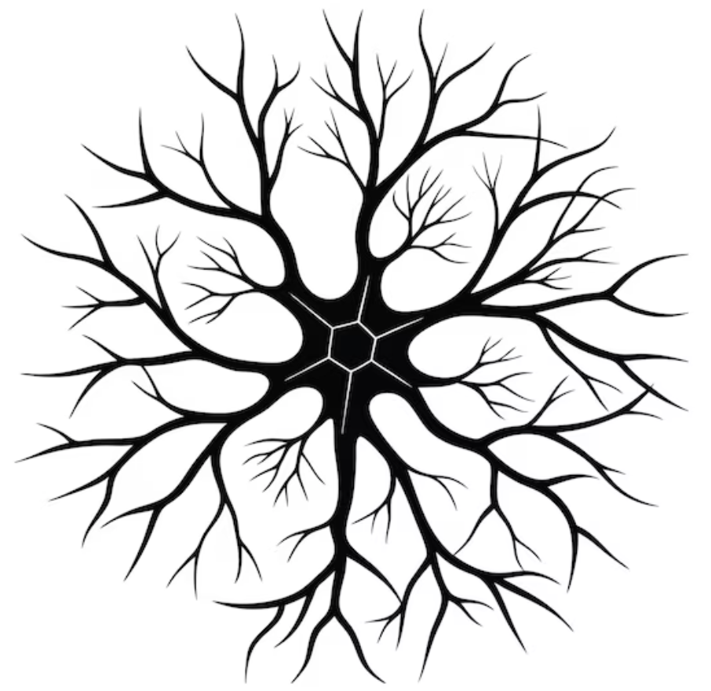

<p align="center">
  
</p>

# 🧠 NeuroSeg Meets DINOv3: Transferring 2D Self-Supervised Visual Priors to 3D Neuron Segmentation via DINOv3 Initialization 

<p align="center">
  <a href="https://arxiv.org/abs/2603.23104"></a>
  <a href="https://github.com/yy0007/NeurINO"></a>
  <a href="https://yy0007.github.io/NeurINO"></a>
</p> 

<!-- <p align="center">
  <a href="https://arxiv.org/abs/XXXX">📄 Arxiv </a> |
  <a href="https://github.com/yy0007/NeurINO">💻 GitHub </a> |
  <a href="https://yy0007.github.io/NeurINO/">🌐 Project Page </a>
</p> -->

## 📰 Latest News

- [2026.03] 📄 arXiv version released
- [2026.03] 🚀 Code released 
- [2026.02] 🎉 NeurINO accepted to CVPR 2026

## 🧬 Related Work

<details open>
<summary>👋 A series of works on topology-aware neuron segmentation and foundation model adaptation for 3D neuroimaging.</summary>

<br> 

> [**Boosting 3D Neuron Segmentation with 2D Vision Transformer Pre-trained on Natural Images**](https://arxiv.org/abs/2405.02686)  
> **Authors:** Yik San Cheng, Runkai Zhao, Heng Wang, Hanchuan Peng, Weidong Cai  
> **TLDR:** Leverages 2D Vision Transformer pre-trained on natural images to initialize 3D neuron segmentation models, improving data efficiency and performance.  
>  
> [](https://arxiv.org/abs/2405.02686)

> [**DINeuro: Distilling Knowledge from 2D Natural Images via Deformable Tubular Transferring Strategy for 3D Neuron Reconstruction**](https://arxiv.org/abs/2410.22078)  
> **Authors:** Yik San Cheng, Runkai Zhao, Heng Wang, Hanchuan Peng, Yui Lo, Yuqian Chen, Lauren J. O'Donnell, Weidong Cai  
> **TLDR:** Introduces a deformable tubular transferring strategy to distill 2D natural image priors into 3D neuron reconstruction, enhancing morphological representation and improving segmentation accuracy.  
>  
> [](https://arxiv.org/abs/2410.22078)

> [**Modeling 3D Mesoscaled Neuronal Complexity through Learning-based Dynamic Morphometric Convolution**](https://www.biorxiv.org/content/10.1101/2025.08.21.671506v1)  
> **Authors:** Yik San Cheng, Runkai Zhao, Heng Wang, Hanchuan Peng, Wojciech Chrzanowski, Weidong Cai  
> **TLDR:** Proposes Dynamic Morph-Aware Convolution (DMAC) with adaptive shape and orientation modeling to capture complex neuronal morphology, significantly improving topology-aware reconstruction.
>  
> [](https://www.biorxiv.org/content/10.1101/2025.08.21.671506v1) [](https://doi.org/10.1186/s40708-025-00288-5)

</details>

## 📊 Datasets

We evaluate NeurINO on three neuronal imaging datasets:

| Dataset | Download |
|--------|----------|
| BigNeuron | https://github.com/BigNeuron/Data/releases |
| NeuroFly | https://zenodo.org/records/13328867 |
| CWMBS | https://github.com/crz22/CWMBS |

## 🧠 Overview

High-quality 3D neuron segmentation is critical for neuroscience, but its progress is hampered by the scarcity of annotated 3D volumetric data. We address this by proposing **NeurINO**, a novel framework that effectively transfers the rich 2D visual representations learned by the self-supervised foundation model DINOv3 into the 3D neuron domain.

NeurINO is developed on top of [MedNeXt](https://github.com/MIC-DKFZ/MedNeXt) framework. It enables:

- Transfer of 2D self-supervised priors into 3D
- Strong intra-slice semantic representation 
- Improved inter-slice aggregation
- Better topology-aware reconstruction

## ⚙️ Installation
### 1. Clone this repository

```bash
git clone https://github.com/yy0007/NeurINO.git
cd NeurINO
```

### 2. Create a conda environment

```bash
conda create -n neurino python=3.10 -y
conda activate neurino
```

### 3. Install dependencies

```bash
pip install -e .
```

## ⚡ Usage

Our framework follows the MedNeXt-style preprocessing and training workflows. 

### 🔧 Preprocessing

Run data preprocessing with:

```bash
neurino_plan_and_preprocess \
    -t 001 \
    -pl3d ExperimentPlanner3D_v21_customTargetSpacing_1x1x1
```

Where:

- `-t 001` = task ID 
- `-pl3d` = 3D planner variant  

### 🚀 Training

General training command: 

```bash
neurino_train \
    3d_fullres <TrainerName> <TASK_ID> <FOLD> \
    -p nnUNetPlansv2.1_trgSp_1x1x1
```

#### Trainer naming convention

| Component | Meaning |
|----------|---------|
| `CenterInfla` / `AvgInfla` | Inflation strategy (center vs. average) | 
| `T` / `S` | DINOv3-Tiny / DINOv3-Small backbone |

#### Examples

##### Center inflation + DINOv3-Tiny

```bash
neurino_train \
    3d_fullres NeurINO_CenterInfla_SGL_T_kernel3 001 0 \
    -p nnUNetPlansv2.1_trgSp_1x1x1
```

##### Average inflation + DINOv3-Small

```bash
neurino_train \
    3d_fullres NeurINO_AvgInfla_SGL_S_kernel3 001 0 \
    -p nnUNetPlansv2.1_trgSp_1x1x1
```

### 🔍 Inference

Inference / evaluation is done with:

```bash
neurino_predict \
    -i <imagesTs_dir> \
    -o <output_dir> \
    -t <TASK_ID> \
    -m 3d_fullres \
    -f <FOLD> \
    -p nnUNetPlansv2.1_trgSp_1x1x1 \
    -tr <TrainerName> \
    -chk model_best
```

## 📞 Contact

If you have any questions or suggestions, feel free to reach out:

- 📧 Email: yiksan.cheng@sydney.edu.au
